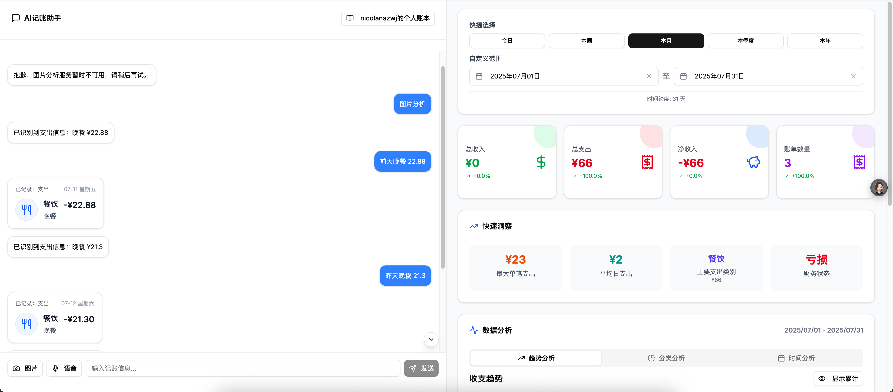

# Molly Bill AI记账助手

<div align="center">
  
  
  <p align="center">
    <em>基于AI的智能记账应用，让记账变得简单有趣</em>
  </p>
  
  <p align="center">
    
    
    
    
    
  </p>
</div>

## 📖 项目简介

Molly Bill是一个现代化的AI智能记账应用，集成了阿里百练Qwen模型，支持多种输入方式（文字、语音、图片），让记账变得像聊天一样简单自然。无论是日常消费记录、预算管理还是财务分析，Molly Bill都能为您提供智能化的解决方案。

## ✨ 核心特性

### 🤖 智能AI识别
- **自然语言处理**: 支持自然语言输入，如"今天在星巴克花了35元买咖啡"
- **智能分类**: 自动识别消费类别（餐饮、交通、购物等）
- **上下文理解**: 理解复杂的消费场景和描述

### 💬 多样化交互方式
- **聊天界面**: 像和朋友聊天一样记录账单
- **语音输入**: 一键语音记录，解放双手
- **图片识别**: 拍照上传账单，AI自动提取关键信息
- **批量导入**: 支持批量处理多个账单

### 📊 数据可视化
- **实时统计**: 收入支出趋势图表
- **分类分析**: 消费类别占比分析
- **时间维度**: 日、周、月、年度财务报告
- **预算管理**: 设置预算目标，智能提醒

### 🔐 安全可靠
- **用户认证**: JWT令牌认证，保护用户数据
- **数据加密**: 敏感信息加密存储
- **权限控制**: 细粒度的用户权限管理

## 🛠 技术架构

### 前端技术栈
- **框架**: Next.js 15 + TypeScript
- **样式**: Tailwind CSS + Radix UI
- **状态管理**: Zustand
- **HTTP客户端**: Axios
- **图表库**: Chart.js / Recharts
- **UI组件**: shadcn/ui

### 后端技术栈
- **框架**: FastAPI + Python 3.9+
- **数据库**: SQLite (开发) / PostgreSQL (生产)
- **ORM**: SQLAlchemy
- **认证**: JWT + OAuth2
- **AI服务**: 阿里百练Qwen模型
- **文件存储**: 本地存储 / 云存储

### 部署架构
- **容器化**: Docker + Docker Compose
- **反向代理**: Nginx
- **CI/CD**: GitHub Actions
- **监控**: 日志记录 + 性能监控

## 🚀 快速开始

### 系统要求
- Node.js 18+ 
- Python 3.9+
- Git

### 1. 克隆项目
```bash
git clone https://github.com/your-username/Molly-bill.git
cd Molly-bill
```

### 2. 后端设置

```bash
cd backend

# 创建虚拟环境
python -m venv venv
source venv/bin/activate  # Windows: venv\Scripts\activate

# 安装依赖
pip install -r requirements.txt

# 配置环境变量
cp env.example .env
# 编辑.env文件，添加必要的配置
```

**环境变量配置示例:**
```env
# 数据库配置
DATABASE_URL=sqlite:///./molly_bill.db

# JWT配置
SECRET_KEY=your-super-secret-key-here
ACCESS_TOKEN_EXPIRE_MINUTES=30

# 阿里百练API配置
DASHSCOPE_API_KEY=your-dashscope-api-key

# 其他配置
DEBUG=True
CORS_ORIGINS=["http://localhost:3000"]
```

### 3. 前端设置

```bash
cd frontend

# 安装依赖
npm install
# 或使用 pnpm
pnpm install

# 启动开发服务器
npm run dev
```

### 4. 获取阿里百练API密钥

1. 访问 [阿里百练控制台](https://bailian.console.aliyun.com/)
2. 注册账号并完成实名认证
3. 创建应用并获取API密钥
4. 在 `backend/.env` 文件中设置 `DASHSCOPE_API_KEY`

### 5. 启动应用

```bash
# 方式1: 分别启动前后端
# 后端 (在backend目录)
uvicorn main:app --reload --host 0.0.0.0 --port 8000

# 前端 (在frontend目录)
npm run dev

# 方式2: 使用Docker Compose
docker-compose up -d
```

🎉 **访问应用**: http://localhost:3000

## 📱 使用指南

### 注册和登录
1. 首次使用需要注册账户
2. 使用邮箱和密码登录系统
3. 系统会自动创建默认账本

### AI记账助手使用
1. **文字输入**: 直接输入消费描述
   ```
   今天在麦当劳吃了汉堡套餐，花了38元
   ```

2. **语音输入**: 点击麦克风按钮说话
   - 支持中文语音识别
   - 自动转换为文字并处理

3. **图片识别**: 上传账单照片
   - 支持小票、发票识别
   - 自动提取金额、商户、时间等信息

### 账单管理
- **查看记录**: 浏览所有账单记录
- **编辑账单**: 修改账单信息
- **删除账单**: 删除错误记录
- **搜索筛选**: 按时间、类别、金额筛选

### 数据分析
- **收支概览**: 查看收入支出总览
- **分类统计**: 各类别消费占比
- **趋势分析**: 消费趋势变化
- **预算管理**: 设置和监控预算

## 🔧 开发指南

### 项目结构
```
Molly-bill/
├── backend/                    # FastAPI后端
│   ├── app/
│   │   ├── api/               # API路由
│   │   ├── core/              # 核心配置
│   │   ├── crud/              # 数据库操作
│   │   ├── models/            # 数据库模型
│   │   ├── schemas/           # Pydantic模型
│   │   ├── services/          # 业务逻辑
│   │   └── utils/             # 工具函数
│   ├── migrations/            # 数据库迁移
│   ├── tests/                 # 测试文件
│   └── requirements.txt       # Python依赖
├── frontend/                   # Next.js前端
│   ├── src/
│   │   ├── app/              # 页面路由
│   │   ├── components/       # React组件
│   │   ├── lib/              # 工具库
│   │   ├── store/            # 状态管理
│   │   └── types/            # TypeScript类型
│   ├── public/               # 静态资源
│   └── package.json          # Node.js依赖
├── docker-compose.yml         # Docker编排
├── nginx.conf                 # Nginx配置
└── README.md                  # 项目文档
```

### 开发工作流
1. **创建功能分支**: `git checkout -b feature/new-feature`
2. **开发和测试**: 编写代码并运行测试
3. **提交代码**: 使用规范的提交信息
4. **创建PR**: 提交Pull Request进行代码审查

### 代码规范
- **Python**: 遵循PEP 8规范
- **TypeScript**: 使用ESLint和Prettier
- **提交信息**: 使用Conventional Commits规范

### 测试
```bash
# 后端测试
cd backend
python -m pytest

# 前端测试
cd frontend
npm run test
```

## 🚀 部署指南

### Docker部署（推荐）
```bash
# 拉代码
git clone https://github.com/Nicolana/Molly-bill.git

# 构建和启动
docker-compose up -d

# 查看日志
docker-compose logs -f

# 停止服务
docker-compose down
```

### 手动部署
1. **准备服务器**: Ubuntu 20.04+ 或 CentOS 7+
2. **安装依赖**: Node.js, Python, Nginx
3. **配置环境**: 设置环境变量和数据库
4. **构建应用**: 编译前端，启动后端
5. **配置Nginx**: 反向代理和静态文件服务

### 云平台部署
- **Vercel**: 前端部署
- **Railway**: 全栈部署
- **AWS/阿里云**: 云服务器部署

## 📊 API文档

### 认证相关
| 方法 | 端点 | 描述 |
|------|------|------|
| POST | `/api/v1/auth/register` | 用户注册 |
| POST | `/api/v1/auth/token` | 用户登录 |
| GET | `/api/v1/auth/me` | 获取当前用户信息 |

### 账单相关
| 方法 | 端点 | 描述 |
|------|------|------|
| GET | `/api/v1/bills/` | 获取账单列表 |
| POST | `/api/v1/bills/` | 创建新账单 |
| PUT | `/api/v1/bills/{id}` | 更新账单 |
| DELETE | `/api/v1/bills/{id}` | 删除账单 |

### AI相关
| 方法 | 端点 | 描述 |
|------|------|------|
| POST | `/api/v1/chat/` | AI聊天对话 |
| POST | `/api/v1/chat/analyze` | 综合分析（文本/图片/音频） |

**完整API文档**: 启动后端服务后访问 http://localhost:8000/docs

## 🤝 贡献指南

我们欢迎所有形式的贡献！

### 如何贡献
1. **Fork项目** 到您的GitHub账户
2. **创建功能分支**: `git checkout -b feature/AmazingFeature`
3. **提交更改**: `git commit -m 'Add some AmazingFeature'`
4. **推送分支**: `git push origin feature/AmazingFeature`
5. **创建Pull Request**

### 贡献类型
- 🐛 Bug修复
- ✨ 新功能开发
- 📚 文档改进
- 🎨 UI/UX优化
- 🔧 性能优化
- 🧪 测试覆盖

### 开发者
感谢所有贡献者的努力！

## 📄 许可证

本项目采用 [MIT许可证](LICENSE)。

## 🆘 支持

如果您在使用过程中遇到问题，可以通过以下方式获得帮助：

- 📧 **邮箱**: support@mollybill.com
- 💬 **GitHub Issues**: [提交问题](https://github.com/your-username/Molly-bill/issues)
- 📖 **文档**: [查看文档](https://docs.mollybill.com)
- 💡 **功能建议**: [功能请求](https://github.com/your-username/Molly-bill/issues/new?template=feature_request.md)

## 🗺 发展路线

### 近期计划 (v1.1)
- [ ] 移动端适配优化
- [x] 多账本支持
- [ ] 数据导出功能
- [ ] 更多AI模型支持

### 中期计划 (v1.2)
- [ ] 团队协作功能
- [ ] 高级数据分析
- [ ] 第三方集成（银行、支付宝等）
- [ ] 离线模式支持

### 长期计划 (v2.0)
- [ ] 移动端App
- [ ] 智能预算建议
- [ ] 财务规划助手
- [ ] 多语言支持

---

<div align="center">
  <p>如果这个项目对您有帮助，请给个 ⭐ Star 支持一下！</p>
  <p>Made with ❤️ by Molly Bill Team</p>
</div> 